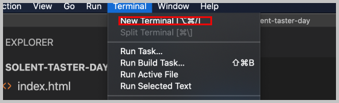

# Some fun with CSS

The purpose of this task is to give you a taster of the powers of HTML and CSS. Further to this, it will also show you how easy it is to distribute code via git and [github](github.com).

Finally, I will show you how we pull all of these technologies together using the VS Code text editor.

All of the tools that we use today are free and you can install them and play around with them at home.

## Task

### Getting Going

- We are going to pull a repository from GitHub to get started. From within command prompt, navigate to a writable directory.
- **Hint,** you can do this by typing `cd` then dragging the folder you want to navigate to into the command window - this will give you a path. Next, press enter to point your command prompt to this writable location.
- We can now clone the starter project, `git clone https://github.com/joeappleton18/solent-taster-day.git`
- Next, type in dir. Can you see a folder called `solent-taster-day` has been created for you. This folder contains our project.
- To open the folder, in the text editor, VS Code, enter the command: `code solent-taster-day`

### Using VS Code

- VS Code is a free, open-source, text editor. Let's see what it can do.

- You should see that there are three three key files in your project: `index.html, style.css, and README.md`. Today, we are only interested in `index and style`.



- Lets see if we can run our project. First, bring up a terminal window (see above).
- In the terminal enter `npx http-server` and press enter. This is going to boot up a web server and give you a link, along the lines of, `http://127.0.0.1:8081`. If you visit this link in a browser window, you'll see our website!
- Hmm, not very impressive! Let's see if we can spice things up. We can do this with some CSS magic.

- Open `index.html` and add ` <link rel="stylesheet" type="text/css" href="style.css">` to the `<head>` section of your page. The head section should now look like this:

```html
...
<head>
  <meta charset="UTF-8" />
  <meta http-equiv="X-UA-Compatible" content="IE=edge" />
  <meta name="viewport" content="width=device-width, initial-scale=1.0" />
  <link rel="stylesheet" type="text/css" href="style.css" />
  <title>Document</title>
</head>
...
```

- Reload the website in your web browser, it should be looking a little different!

### Extra Work

- See if you can update the text, change the speed of the animation, and change the background color.
